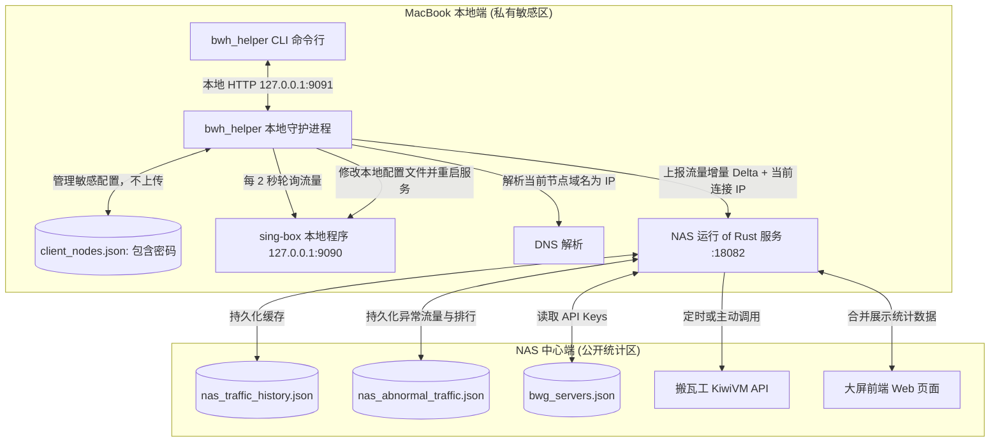

# 📊 BandwagonHost & sing-box 分布式流量统计与节点管理系统

本系统是一套专为 **BandwagonHost (搬瓦工) VPS** 与本地 **sing-box 客户端** 设计的代理流量真相审计系统。它不仅看“还剩多少额度”，还要看清代理服务器真实消耗、全部流量分布、每台设备的代理流量，以及其中本不该走代理的流量。

---

## 🏗️ 系统定位与拓扑分工

系统采用**前后端分离**的物理隔离架构，大盘端只负责汇总和呈现，客户端负责本地控制与安全上报：



### 1. 🛡️ 核心隐私安全原则
* **配置物理隔离**：所有的敏感节点配置（如连接密码、Trojan 协议、SNI 混淆域名等）全部保留在本地 Mac 端的 `client_nodes.json` 文件中，绝对不会上传到 NAS 端，大屏页面也不提供任何节点添加/修改的接口，防止密码在网络及公共大盘暴露。
* **节点 IP 上报**：本地客户端若使用的是域名，将在本地通过 DNS 解析出实际出站 IP，仅向服务器上报当前的**服务器 IP 加上流量增量 Delta**。
* **大盘无感聚合**：NAS 端根据写死的 `bwg_servers.json` 主机 IP 列表进行比对，自动将客户端上报的 IP 流量与各服务器聚合，实现“哪个设备在哪台服务器上用了多少流量”的归类展示。
* **异常代理识别**：客户端与 NAS 服务端都会基于同一套直连候选规则识别 `.cn`、国内服务、局域网地址等“不该走代理”的流量，并支持用 `DIRECT_SUFFIXES` / `DIRECT_SUFFIXES_FILE` 扩展规则。
* **上报鉴权**：`/api/report` 默认需要 `REPORT_TOKEN`，避免公网大盘被任意写入或污染统计数据。
* **上报幂等**：每批 10 分钟 delta 都携带稳定 `report_id`。网络抖动导致客户端重试时，NAS 会识别重复报告并避免二次累计。

---

## 📦 macOS (Apple Silicon M系列) 客户端安装

我们已为 Apple Silicon 架构的 Mac 系统打好了 `bwh_helper` 本地包。

### 1. 快速安装
下载并解压 `bwh_helper_mac_silicon.zip`，将其移动到您的系统执行路径中，并赋予执行权限：

```bash
# 解压文件
unzip bwh_helper_mac_silicon.zip

# 移动到系统可执行目录 (需要 sudo 权限)
sudo mv bwh_helper /usr/local/bin/

# 赋予执行权限
chmod +x /usr/local/bin/bwh_helper
```

### 2. 命令行使用手册
小助手提供了丰富的 `bwh_helper` 命令行工具：

* **查看运行状态与大盘连接**：
  ```bash
  bwh_helper status
  ```
  *输出示例：*
  ```text
  ========================================
  💻 本机设备名称: MacBookPro
  🌐 当前出站节点: 12.34.56.78:443
  ⚙️  sing-box 状态: 🟢 在线
  📊 累计下载流量: 24.44 GB
  📊 累计上传流量: 21.49 GB
  📦 NAS 大盘状态: 🟢 已连接 (https://your-nas-domain.com:8443)
  ========================================
  ```

* **管理本地私有节点**：
  ```bash
  # 列出本地保存的所有节点配置
  bwh_helper node list

  # 手动添加新的私密节点
  bwh_helper node add --name "香港 Trojan" --server "vps1.your-vps-domain.com" --port 443 --password "your_password" --sni "vps1.your-vps-domain.com"

  # 删除指定的本地节点
  bwh_helper node delete "香港 Trojan"

  # 一键切换并热重载本地的 sing-box 节点
  bwh_helper node switch "香港 Trojan"
  ```

* **管理本机 sing-box 服务**：
  ```bash
  # 启动、停止、重启本机 sing-box
  bwh_helper singbox start
  bwh_helper singbox stop
  bwh_helper singbox restart
  ```
  CLI 会优先请求本地 `bwh_helper daemon` 的 `127.0.0.1:9091` 管理接口；如果 daemon 没有运行，会使用同一套受限命令在当前进程直接执行。默认 macOS 命令为：
  ```bash
  /usr/bin/sudo -n /opt/homebrew/bin/brew services restart sing-box
  ```
  如果你的 sing-box 是通过 sudo 启动的，需要为 `brew services` 配置免交互 sudo，否则 helper 不能在后台输入密码：
  ```sudoers
  # 用 whoami 替换 <your_user>，用 command -v brew 确认 brew 路径
  <your_user> ALL=(root) NOPASSWD: /opt/homebrew/bin/brew services start sing-box, /opt/homebrew/bin/brew services stop sing-box, /opt/homebrew/bin/brew services restart sing-box
  ```
  建议用 `sudo visudo` 或 `sudo visudo -f /etc/sudoers.d/bwh_helper_singbox` 添加，避免 sudoers 语法写错导致 sudo 不可用。若不是 Homebrew 服务，也可以设置 `SINGBOX_START_CMD`、`SINGBOX_STOP_CMD`、`SINGBOX_RESTART_CMD`，但 helper 只允许 `brew services <action> sing-box`、`systemctl <action> sing-box` 或受限的 `launchctl` sing-box 服务命令。

  如果 sing-box 已经作为 root LaunchDaemon 运行，例如 label 是 `system/homebrew.mxcl.sing-box`，可以使用更窄的 launchctl 配置：
  ```bash
  SINGBOX_START_CMD="/usr/bin/sudo -n /bin/launchctl start system/homebrew.mxcl.sing-box"
  SINGBOX_STOP_CMD="/usr/bin/sudo -n /bin/launchctl stop system/homebrew.mxcl.sing-box"
  SINGBOX_RESTART_CMD="/usr/bin/sudo -n /bin/launchctl kickstart -k system/homebrew.mxcl.sing-box"
  ```
  对应 sudoers 只需要放行这三条：
  ```sudoers
  <your_user> ALL=(root) NOPASSWD: /bin/launchctl start system/homebrew.mxcl.sing-box, /bin/launchctl stop system/homebrew.mxcl.sing-box, /bin/launchctl kickstart -k system/homebrew.mxcl.sing-box
  ```

* **运行后台流量上报守护进程 (Daemon)**：
  ```bash
  # 启动后台守护进程进行流量采集和自动上报 (默认向公网 https://your-nas-domain.com:8443 上报)
  bwh_helper daemon
  ```
  如果需要向自定义的服务端上报，可配置环境变量：
  ```bash
  REPORT_TOKEN=<shared-token> NAS_SERVER_URL=https://your-nas-domain.com:8443 DEVICE_NAME=MyMac bwh_helper daemon
  ```
  `REPORT_TOKEN` 必须与 NAS 服务端的 `REPORT_TOKEN` 一致。客户端默认 2 秒采集一次、10 分钟上报一次流量 delta，并每 30 秒发送一次轻量心跳用于在线状态。未成功上报的流量会暂存在 `client_pending_report.json`，下次成功后再清空。
  如需排除大盘控制面自身产生的代理流量，可设置 `CONTROL_DOMAIN_SUFFIXES=your-nas-domain.com`；未设置时客户端会自动从 `NAS_SERVER_URL` 提取 host 做精确排除。

  如果希望“本地 helper 重启时顺手重启 sing-box”，可以显式开启：
  ```bash
  SINGBOX_RESTART_ON_DAEMON_START=true bwh_helper daemon
  ```
  这个开关默认关闭，避免每次 helper 升级或重启都打断当前代理连接。

---

## 🌐 NAS 服务端部署与配置

### 1. 服务端部署
服务端使用 Rust 编译，运行于 NAS 设备，并由 Caddy 等反向代理工具提供公网 HTTPS 入口（例如 `https://your-nas-domain.com:8443`）。

您可以使用项目根目录下的部署脚本一键推送至 NAS 服务器：
```bash
REPORT_TOKEN=$(openssl rand -hex 32) ./deploy.sh
```
部署脚本会拒绝缺少 `REPORT_TOKEN` 的部署；如果本地存在 `bwg_servers.json`，会自动上传到 NAS。否则会尝试用 `VEID`、`API_KEY`、`BWG_SERVER_IP` 生成一份单服务器配置。

### 2. 服务端配置文件
所有的配置文件均保存在 NAS 的 `/opt/bwg_usage` 目录下：
* **`config.env`**：服务环境变量（静态文件路径、绑定端口、上报鉴权等）。核心项：
  ```bash
  PORT=18082
  STATIC_DIR=/opt/bwg_usage/static
  REPORT_TOKEN=<shared-token>
  REPORT_AUTH_REQUIRED=true
  DASHBOARD_TOKEN=<dashboard-token>
  READ_AUTH_REQUIRED=true
  DEVICE_ONLINE_SECS=90
  DIRECT_SUFFIXES=example.internal,company.cn
  CONTROL_DOMAIN_SUFFIXES=your-nas-domain.com
  ```
  如需临时内网调试，可显式设置 `REPORT_AUTH_REQUIRED=false` 或 `READ_AUTH_REQUIRED=false`，公网部署不建议关闭。`DASHBOARD_TOKEN` 默认可与 `REPORT_TOKEN` 相同，前端第一次访问受保护 API 时会提示输入并保存到浏览器本地。

* **`bwg_servers.json`**：配置您拥有的多台搬瓦工 VPS 服务器的 API 凭证，用于定时拉取官方已用流量：
  ```json
  [
    {
      "name": "VPS-01",
      "veid": "your_bwg_veid",
      "api_key": "private_yourBwgApiKeyHere",
      "ip": "12.34.56.78"
    }
  ]
  ```

---

## 📈 24*7 滚动异常流量监控
为了防御和发现异常的漏风流量（如大陆域名误走代理出国），系统集成了 VPS 日志流量抓取引擎：
1. **VPS 侧统计服务**：在 VPS 上运行 `bwg_usage v2ray-traffic` 守护服务，以 3秒 间隔轮询抓取套接字并匹配日志域名，将结果暂存在 `/var/log/v2ray/domain_traffic.json`。
2. **24*7 滚动刷新**：NAS 服务端每隔 **60 秒** 会自动通过 SSH 向多台 VPS 并行抓取最新的 Accepted 连接明细和域名流量数据，实现近实时的滚动汇总更新。
3. **大盘持久化**：抓取到的异常明细和 Top 10 域名流量排行会被自动写入 NAS 的 `/opt/bwg_usage/nas_abnormal_traffic.json` 中，确保服务端重启或部署更新后，历史累计排行数据不会丢失。

### 当前统计口径
* **客户端代理流量**：只统计 sing-box `/connections` 中 `chains[0] == "proxy"` 的连接 delta。
* **异常代理流量**：在代理流量中命中直连候选规则的域名/IP，例如 `.cn`、常见国内服务、局域网地址，以及 `DIRECT_SUFFIXES` / `DIRECT_SUFFIXES_FILE` 中扩展的后缀。
* **设备在线状态**：由 30 秒心跳刷新，默认 90 秒内有上报或心跳即视为在线。
* **官方历史趋势**：按每台搬瓦工服务器独立保存 `data_counter` 基准，再汇总到小时趋势，避免不同 VPS 重置周期互相污染。
* **上报去重**：NAS 端按设备保存最近 500 个 `report_id`。同一批 delta 重试时只刷新在线状态，不重复累加设备、节点和排行流量。
* **短连接限制**：客户端首次看到连接时只记录基准以防虚大；两次采样间出现并结束的极短连接可能无法完整捕获。VPS 侧域名排行可作为补充观察源。

---

## 📖 系统详细架构与指标口径
关于本项目的总体产品目标、微服务技术方案、拓扑数据链路以及看板所有图表与明细数据（如官方流量、代理流量、在线判定、异常网址去重计数等）的精准计算口径，请阅读：
* [项目设计白皮书：产品目标、技术方案、数据链路与指标口径 (ARCHITECTURE.md)](ARCHITECTURE.md)
